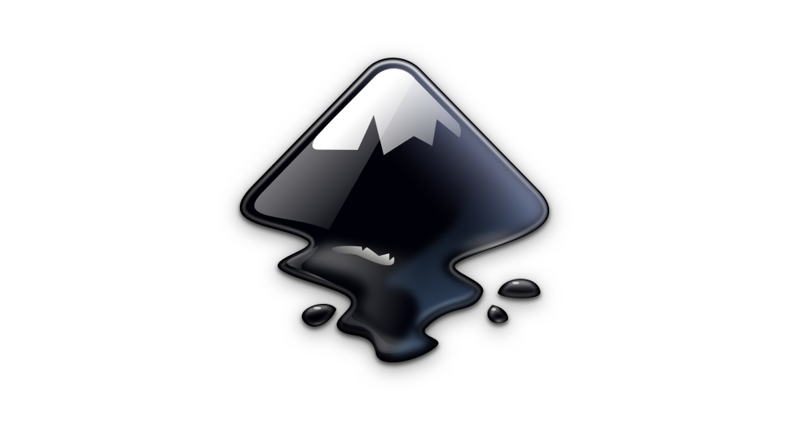
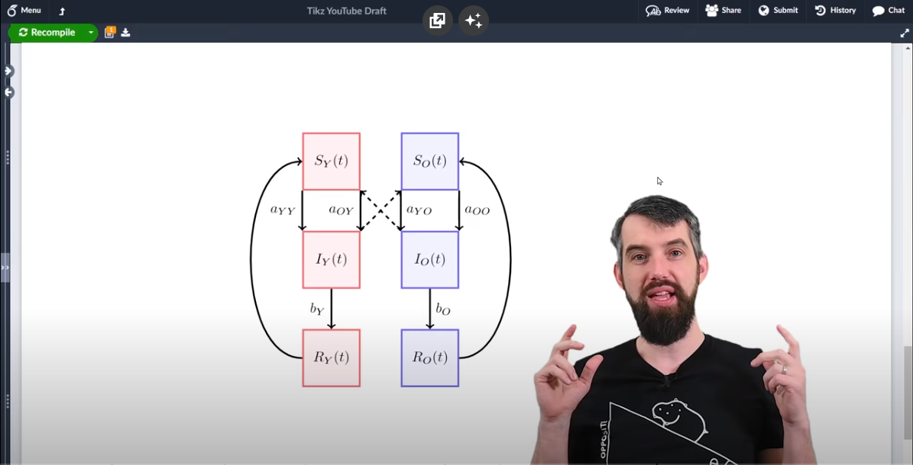

# Inkscape tutorial  

This tutorial is made with version 1.3.2.

<a href="https://www.youtube.com/watch?v=MZXZwYeJMAw">
Youtube video  

</a>

## Repository Structure

The repository contains a couple of drawing examples made with Inkscape.

## Install

### Inkscape

Follow the steps in https://inkscape.org.

### TexText

Install [TexText](https://textext.github.io/textext/index.html) to write LaTeX mathematical equations.

 

### Adding new fonts

It is possible to download new fonts on your PC. After adding the fonts on your OS, they should be usable anywhere (Microsoft Word, Inskcape, ...).
We advise you to install the LaTeX font ``CMU Serif``: https://fontlibrary.org/en/font/cmu-serif.

### svg2tikz

SVG2TikZ, formally known as Inkscape2TikZ, are a set of tools for converting SVG graphics to TikZ/PGF code.

Visit https://github.com/xyz2tex/svg2tikz for further information.

Here is a nice video motivating the use of ``tikz`` for ``LaTeX``:

## Contributions

Contributions to this project are welcome. If you find any issues or want to add new features, please open an issue or submit a pull request.

## License

This project is licensed under the [MIT License](LICENSE).

## Contact

Don't hesitate to discuss with me either on Github directly or email me at o.leblanc@uclouvain.be.
